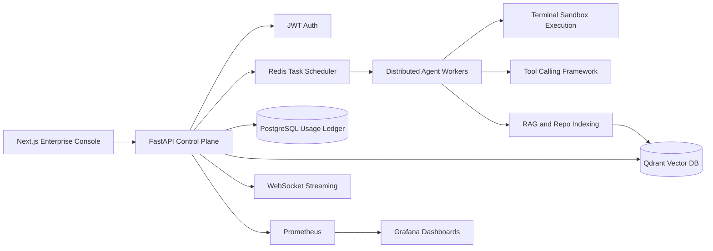

# ForgeMind AI

ForgeMind AI is an enterprise multi-agent coding platform for internal engineering organizations. It combines autonomous coding workflows, repository intelligence, RAG, tool calling, terminal sandbox execution, and token governance into one production-oriented control plane.

The project is structured like an AI infrastructure startup repository: Next.js console, FastAPI control plane, PostgreSQL ledger, Redis queues, Qdrant vector storage, Docker Compose deployment, Kubernetes manifests, CI/CD, observability, and example agents.

## Architecture



## Platform Metrics

- 40B+ monthly tokens processed
- 180K+ daily agent executions
- 120+ active repositories
- 3,200 concurrent tasks
- Multi-region support for us-east-1, eu-west-1, and ap-southeast-1
- Distributed sandbox execution for autonomous coding workflows

## Features

- Multi-agent orchestration for coding, review, repository analysis, DevOps, and documentation
- Long-context repository indexing with deterministic demo embeddings and Qdrant storage
- RAG pipeline for source-aware reasoning and retrieval
- Tool calling framework foundation for terminal, GitHub, CI, and deployment tools
- Streaming WebSocket response examples for live agent run traces
- JWT authentication with demo enterprise admin login
- Usage analytics dashboard with token consumption and spend monitoring
- Dockerized local deployment with PostgreSQL, Redis, Qdrant, Prometheus, and Grafana
- Kubernetes-ready manifests with horizontal scaling
- CI/CD workflow for backend compile checks, frontend lint/build, and Docker image builds

## Quick Start

```bash
cd infra
docker compose up --build
```

Services:

- Frontend: http://localhost:3000
- Backend API: http://localhost:8000
- API docs: http://localhost:8000/docs
- Prometheus: http://localhost:9090
- Grafana: http://localhost:3001

Demo credentials:

```text
admin@forgemind.ai
forgemind
```

## API Examples

```bash
curl http://localhost:8000/api/health
```

```bash
curl -X POST http://localhost:8000/api/auth/login \
  -H "Content-Type: application/json" \
  -d '{"email":"admin@forgemind.ai","password":"forgemind"}'
```

```bash
curl -X POST http://localhost:8000/api/tasks \
  -H "Content-Type: application/json" \
  -d '{"agent":"CodingAgent","repository":"github.com/acme/platform","objective":"Add tests for billing retries","priority":"critical"}'
```

WebSocket stream:

```text
ws://localhost:8000/ws/agent-runs/run_8b11
```

## Screenshots

Place product screenshots in `frontend/public/screenshots` when publishing the project.

## Benchmark Snapshot

| Workload | Throughput | p95 Latency | Token Volume |
| --- | ---: | ---: | ---: |
| Repository indexing | 72.4M chunks/month | 1.8s retrieval | 11.6B tokens |
| Autonomous coding runs | 186K runs/day | 18.4s first plan | 15.2B tokens |
| Review and security | 92K reviews/day | 9.2s first finding | 8.9B tokens |

## Roadmap

- Policy-driven model routing and budget enforcement
- Native GitHub App integration
- Ephemeral sandbox worker pool
- OpenTelemetry traces across agent workflows
- Enterprise SSO and SCIM provisioning
- Human approval gates for production write actions

## License

MIT License. See [LICENSE](LICENSE).
# ForgeMind-AI
