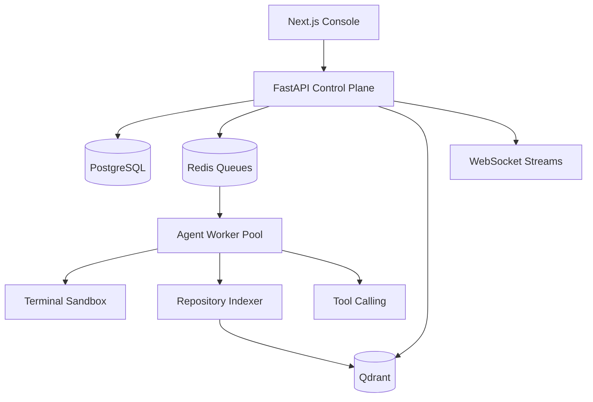

# Architecture

ForgeMind AI is organized around a control-plane and worker-plane architecture.

## Core Components

- Frontend console: operational dashboard, agent run explorer, token usage, repositories, and settings.
- FastAPI control plane: authentication, task submission, run metadata, usage snapshots, and streaming.
- Agent runtime: coding, review, repo analysis, DevOps, and documentation agents.
- RAG pipeline: repository discovery, chunking, embedding, and vector upsert.
- Data plane: PostgreSQL for ledgers, Redis for scheduling, Qdrant for semantic retrieval.
- Observability: Prometheus scrape config and Grafana dashboard provisioning.

## Scaling Model

The system supports horizontal API replicas and distributed worker pools. Redis queues separate critical tasks, indexing workloads, and sandbox execution. Kubernetes HPA config scales the backend based on resource utilization, while production worker pools should scale from queue lag and token throughput.
